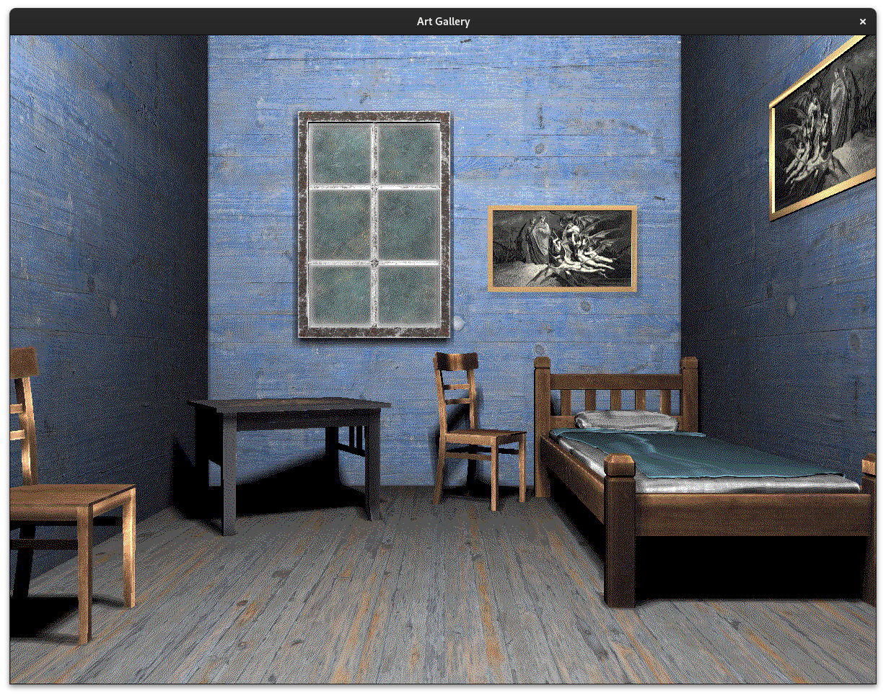
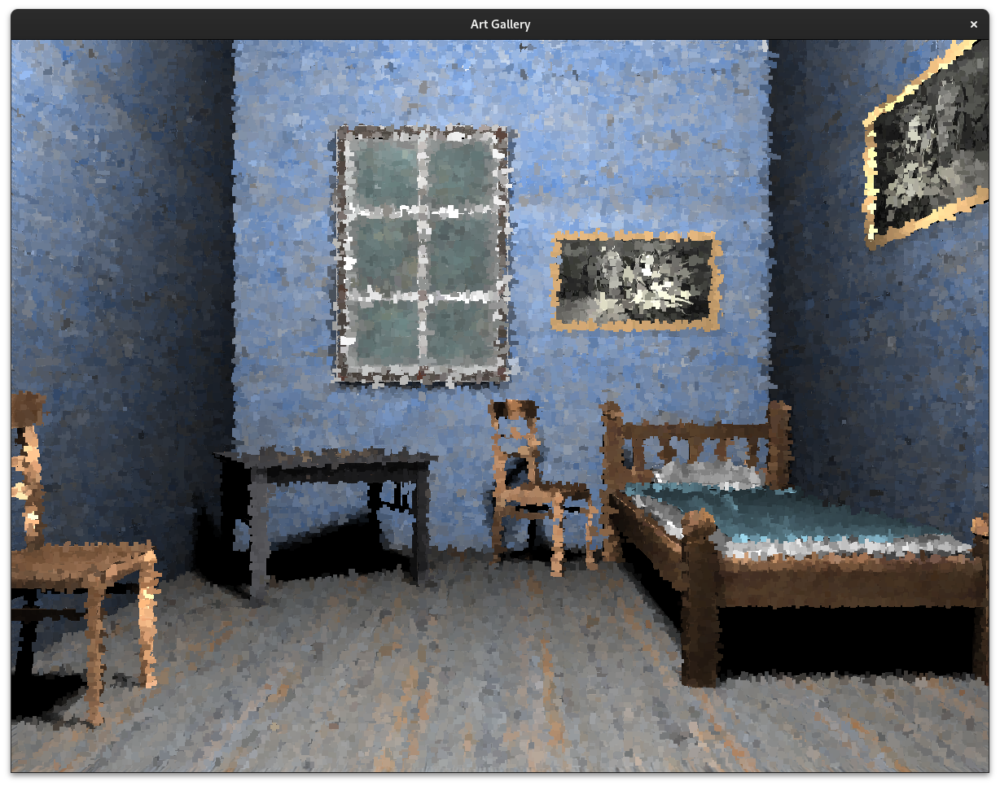
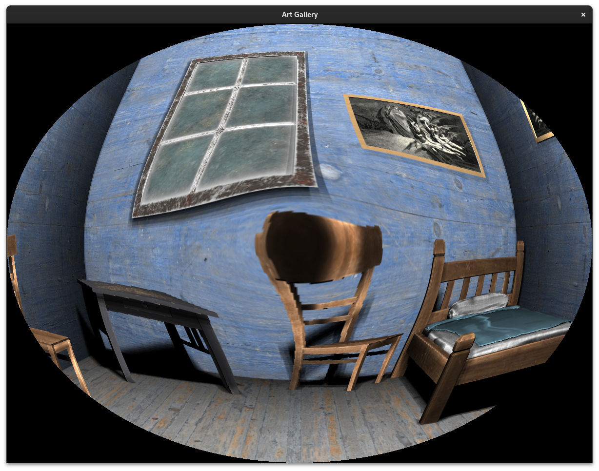
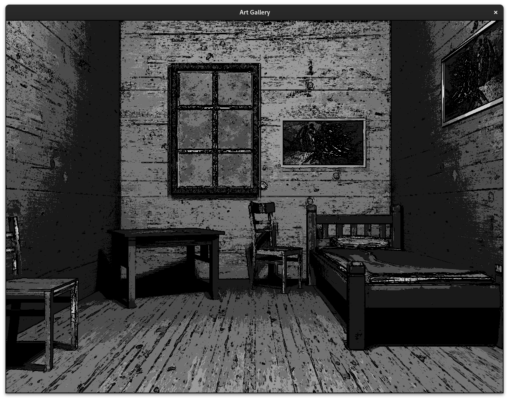
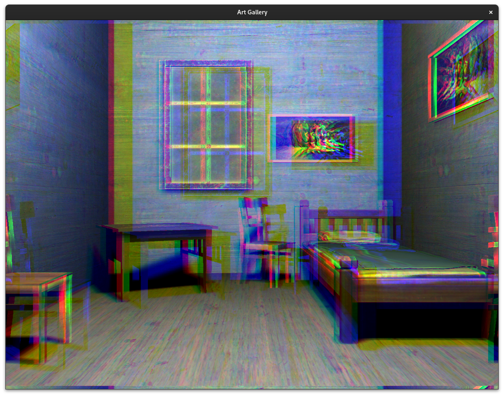
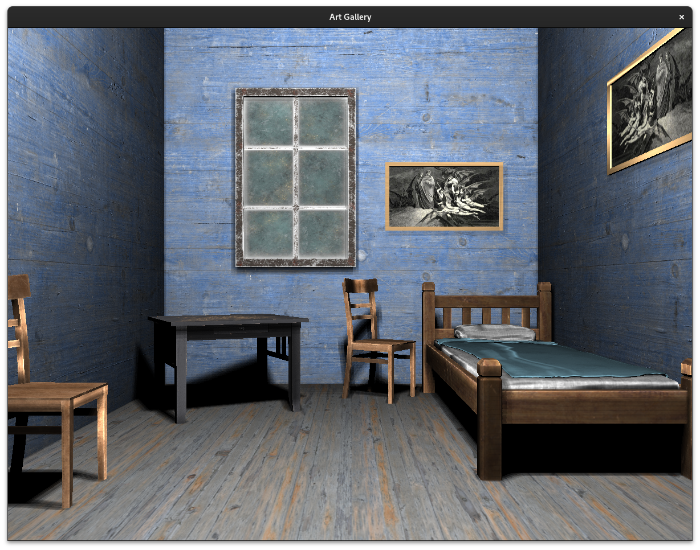

# Art Gallery

An OpenGL project in c++

## Aim

Create an interactive environment with 6 rooms that correspond to different render styles

#### Render Styles

- Floyd-Steinberg Dithering
  
- Painterly Rendering
  
- Fish Eye Effect
  
- Toon Shading
  
- Chromatic Aberration Effect
  
- No style
  

### Switching between rooms

In the hub room there are 6 paintings, each one corresponding to a different render style. The user can enter a painting to switch to the corresponding room.

You can read the report for a more thorough explanation
